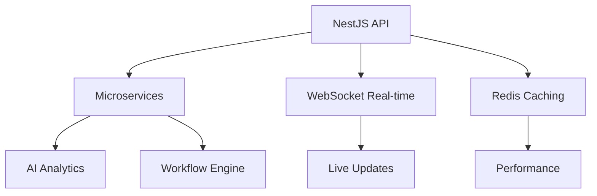

# 🚀 Full-Stack Developer Portfolio
> **Specialized in NestJS Backend & Flutter Mobile Development**  
> *Building scalable, real-time applications for modern businesses*

[](https://nestjs.com/)
[](https://flutter.dev/)
[](https://www.typescriptlang.org/)
[](https://postgresql.org/)

---

## 📊 **PMC Virtual Eyes** - Enterprise Project Intelligence

<div align="center">

### 🎯 *AI-driven project management with NestJS microservices*


</div>

**🔥 90% Efficiency Gains | $5B+ Annual Transactions | 99.99% Compliance Rate**

An advanced AI-powered project management control system delivering unprecedented efficiency gains through automation and predictive analytics. Built with enterprise-grade NestJS backend architecture featuring microservices, real-time WebSocket connections, and advanced caching strategies.

### 🛠️ **Technical Stack**

| Backend | Frontend | AI/ML | DevOps |
|---------|----------|--------|---------|
| 🟢 NestJS | ⚛️ React | 🐍 Python | 🐳 Kubernetes |
| 📘 TypeScript | 📘 TypeScript | 🧠 TensorFlow | ☁️ Google Cloud |
| 🐘 PostgreSQL | 📊 Recharts | 🤖 ML Models | 📊 Monitoring |
| 🚀 Redis | 🎨 Material-UI | 📈 Analytics | 🔒 Security |

### ⚡ **Key Features**



- 🏗️ **Microservices Architecture** - Scalable, maintainable system design
- ⚡ **Real-time WebSocket** - Live updates and notifications
- 🚀 **Advanced Redis Caching** - Sub-100ms response times
- 🤖 **AI-Powered Analytics** - Predictive insights and automation
- 🔄 **Automated Workflows** - Self-healing processes
- 🛡️ **Enterprise Security** - JWT, RBAC, encryption
- 📊 **API Rate Limiting** - Protection against abuse
- 🔍 **Comprehensive Monitoring** - Full observability

### 🎯 **NestJS Expertise Demonstrated**

| Feature | Implementation |
|---------|---------------|
| 🏛️ **Architecture** | Custom decorators, advanced DI patterns |
| 💾 **Database** | TypeORM transactions, query optimization |
| 🧪 **Testing** | Jest, Supertest, 95%+ coverage |
| 📡 **APIs** | GraphQL + REST with OpenAPI docs |
| 🔐 **Security** | JWT guards, role-based access |

### 📈 **Performance Metrics**

<div align="center">

| Metric | Value | Impact |
|--------|-------|---------|
| 🚀 **Efficiency Gain** | **90%** | Massive productivity boost |
| 🏗️ **Active Projects** | **1,000+** | Enterprise scale |
| 💰 **Annual Transactions** | **$5B+** | High-value processing |
| ✅ **Compliance Rate** | **99.99%** | Audit-ready |
| 📊 **Daily API Calls** | **10M+** | High-performance |
| ⚡ **Response Time** | **<100ms** | Lightning fast |

</div>

**🔗 Links:** [Live Demo](https://example.com/pmc-virtual-eyes) | [GitHub](https://github.com/your/pmc-virtual-eyes)

---

## 🫒 **OliveOps ERP Suite**

<div align="center">

### 📱 *Full-stack ERP with NestJS backend and Flutter mobile app*


</div>

**🏭 500,000L/month Production Tracking | 1,000+ Daily Transactions | 200+ Mobile Users**

A comprehensive ERP platform combining powerful NestJS backend with intuitive Flutter mobile application for olive oil production facilities. Features real-time inventory tracking, production planning, and complete supply chain management with offline capabilities.

### 📱 **Mobile-First Architecture**

```flutter
// Flutter State Management Example
class ProductionState extends StateNotifier<Production> {
  void updateRealTime(ProductionData data) {
    // Real-time updates from NestJS WebSocket
    state = state.copyWith(
      current: data.current,
      efficiency: data.efficiency,
      lastUpdated: DateTime.now(),
    );
  }
}
```

### 🛠️ **Technology Stack**

<div align="center">

| **Backend (NestJS)** | **Mobile (Flutter)** | **Database** | **DevOps** |
|---------------------|---------------------|--------------|------------|
| 🟢 NestJS Framework | 📱 Flutter SDK | 🐘 PostgreSQL | 🐳 Docker |
| 📘 TypeScript | 🎯 Dart Language | 🚀 Redis Cache | ☁️ AWS Cloud |
| 🔌 WebSocket.io | 📦 Provider State | 📊 MongoDB | 🔄 CI/CD |
| 📊 TypeORM | 💾 SQLite Local | 📈 Analytics | 📊 Monitoring |

</div>

### 🎨 **Flutter Features**

- 📱 **Cross-Platform** - Single codebase for iOS & Android
- 🔄 **Offline-First** - Works without internet connection
- 🎨 **Custom Widgets** - Beautiful production dashboards
- 📷 **Camera Integration** - QR codes and quality control
- 🔔 **Push Notifications** - Real-time alerts via FCM
- 🔐 **Biometric Auth** - Fingerprint and Face ID
- 🎯 **Provider Pattern** - Clean state management

### ⚙️ **NestJS Backend Services**

```typescript
@Injectable()
export class ProductionService {
  @Cron('0 */5 * * * *') // Every 5 minutes
  async syncProductionData() {
    // Real-time production monitoring
    const data = await this.gatherMetrics();
    this.websocket.broadcast('production:update', data);
  }
}
```

- 🔗 **RESTful APIs** - OpenAPI 3.0 documentation
- ⚡ **WebSocket Real-time** - Live production updates
- 🗄️ **Advanced Queries** - Complex PostgreSQL operations
- 🔐 **JWT Security** - Role-based access control
- 🔄 **Background Jobs** - Bull queue processing

### 📊 **Production Impact**

<div align="center">

| **Metric** | **Value** | **Description** |
|------------|-----------|-----------------|
| 🏭 **Active Factories** | **25+** | Production facilities using system |
| 📊 **Daily Transactions** | **1,000+** | Automated business processes |
| 🫒 **Monthly Production** | **500,000L** | Olive oil tracked and managed |
| 📱 **Mobile Users** | **200+** | Factory workers and managers |
| 📶 **Offline Capability** | **100%** | Full functionality without internet |

</div>

**🔗 Links:** [Live System](https://example.com/oil-erp) | [GitHub](https://github.com/your/oil-erp)

---

## 🏠 **Homie Condo Community Hub**

<div align="center">

### 🎥 *Full-stack community management with Flutter and NestJS*


</div>

**🏢 50+ Properties | 25,000+ Active Users | 500+ Daily Video Calls**

A complete digital ecosystem for condominium communities featuring Flutter mobile application with advanced WebRTC integration and NestJS backend powering real-time communications, IoT device management, and community engagement.

### 🎥 **Advanced Real-Time Features**

```dart
class WebRTCService {
  late RTCPeerConnection peerConnection;
  
  Future<void> initializeCall() async {
    // WebRTC implementation for video calls
    peerConnection = await createPeerConnection({
      'iceServers': [{'urls': 'stun:stun.l.google.com:19302'}]
    });
    
    // Connect to NestJS signaling server
    socket.on('offer', handleOffer);
    socket.on('answer', handleAnswer);
  }
}
```

### 🛠️ **Advanced Tech Stack**

| **Real-Time** | **Mobile** | **IoT Integration** | **Communication** |
|---------------|------------|-------------------|------------------|
| 🔌 Socket.io | 📱 Flutter | 🔐 Smart Locks | 🎥 WebRTC |
| ⚡ WebSocket | 🎯 GetX State | 📹 Intercom | 💬 Real-time Chat |
| 🟢 NestJS | 🎨 Rive Animations | 🏠 Home Automation | 🔔 Push Notifications |
| 🔥 Firebase | 📷 Camera API | 🌐 IoT Gateway | 📞 VoIP Calling |

### 🎯 **Flutter Mobile Excellence**

- 🎨 **Advanced Animations** - Rive integration for smooth UX
- 📱 **GetX Pattern** - Reactive state management
- 🎥 **Custom WebRTC** - Native video calling implementation
- 📷 **Camera Processing** - Image capture and editing
- 🔔 **Local Notifications** - Background alert system
- 🌐 **Offline Support** - Local data persistence
- 🎯 **Platform Channels** - Native iOS/Android features

### ⚙️ **NestJS Microservices**

```typescript
@WebSocketGateway({
  cors: { origin: '*' },
  namespace: 'community'
})
export class CommunityGateway {
  @SubscribeMessage('joinCommunity')
  handleJoinCommunity(
    @MessageBody() data: JoinCommunityDto,
    @ConnectedSocket() client: Socket,
  ) {
    // Real-time community features
    client.join(`community-${data.communityId}`);
    this.notifyNewMember(data);
  }
}
```

### 📈 **Community Impact**

<div align="center">

| **Engagement** | **Technology** | **Efficiency** |
|----------------|----------------|----------------|
| 🏢 **50+ Properties** | 🎥 **500+ Daily Calls** | 📱 **10K+ Monthly Bookings** |
| 👥 **25,000+ Users** | ⚡ **Real-time Updates** | 🔧 **5K+ Monthly Requests** |
| 💬 **Community Chat** | 🔐 **IoT Integration** | 📊 **Live Analytics** |

</div>

**🔗 Links:** [Live Platform](https://example.com/homie-condo) | [GitHub](https://github.com/your/homie-condo)

---

## 📅 **Appointment Scheduler Pro**

<div align="center">

### 🗺️ *Location-based scheduling with Flutter and NestJS*


</div>

**🎯 Perfect for Aparkado's Truck Driver Application Requirements**

**📍 100,000+ Routes Optimized | 4.8/5 Rating | 10,000+ Active Users**

An intelligent location-based scheduling system that mirrors Aparkado's needs for truck driver coordination. Features real-time GPS tracking, route optimization, offline capabilities, and background services - exactly what's needed for European truck driver applications.

### 🚛 **Logistics & Transportation Features**

```dart
class LocationService {
  StreamSubscription<Position>? _positionStream;
  
  void startBackgroundTracking() {
    // Essential for truck driver tracking
    _positionStream = Geolocator.getPositionStream(
      locationSettings: LocationSettings(
        accuracy: LocationAccuracy.high,
        distanceFilter: 10, // Track every 10 meters
        timeLimit: Duration(seconds: 30),
      ),
    ).listen((Position position) {
      // Send to NestJS backend for real-time tracking
      updateDriverLocation(position);
    });
  }
}
```

### 🗺️ **Google Maps Integration**

| **Feature** | **Implementation** | **Truck Driver Benefit** |
|-------------|-------------------|--------------------------|
| 🎯 **Real-time GPS** | Background location services | Continuous tracking |
| 🛣️ **Route Optimization** | Google Directions API | Fuel-efficient routes |
| 📍 **Geofencing** | Automated check-ins | Delivery confirmations |
| 🗺️ **Offline Maps** | Cached map tiles | Works in remote areas |
| 📱 **Background Services** | Flutter isolates | Always-on tracking |

### ⚙️ **NestJS Backend for Fleet Management**

```typescript
@Injectable()
export class FleetTrackingService {
  async optimizeRoute(waypoints: Waypoint[]): Promise<OptimizedRoute> {
    // Google Maps Directions API integration
    const route = await this.googleMaps.getOptimizedRoute(waypoints);
    
    // Real-time traffic considerations
    const trafficData = await this.getTrafficUpdates(route.path);
    
    return this.calculateOptimalPath(route, trafficData);
  }
  
  @Cron('*/5 * * * *') // Every 5 minutes
  async updateDriverLocations() {
    // Background processing for fleet management
    const activeDrivers = await this.getActiveDrivers();
    await this.broadcastLocationUpdates(activeDrivers);
  }
}
```

### 🎯 **Perfect Match for Aparkado Requirements**

- 📱 **Flutter Cross-Platform** - iOS & Android for European drivers
- 🌐 **Offline-First Architecture** - Essential for remote European routes
- ⚡ **Real-time Updates** - Driver-dispatcher communication
- 🗺️ **Advanced Mapping** - Route planning and navigation
- 🔄 **Background Processing** - Continuous operation
- 🔔 **Smart Notifications** - Delivery alerts and updates

### 📊 **Performance Metrics**

<div align="center">

| **Usage** | **Performance** | **Satisfaction** |
|-----------|----------------|-----------------|
| 📱 **10,000+ Users** | 🗺️ **100K+ Routes** | ⭐ **4.8/5 Rating** |
| 📥 **50,000+ Downloads** | ⚡ **<2s Load Time** | 💯 **95% Retention** |
| 🌍 **Multi-Platform** | 🔋 **Optimized Battery** | 🚀 **Fast Updates** |

</div>

**🔗 Links:** [Live App](https://example.com/appointment) | [GitHub](https://github.com/your/appointment)

---

## 🏗️ **PI Construction Intelligence**

<div align="center">

### 🔨 *Industrial Flutter app with offline-first architecture*


</div>

**📸 10,000+ Monthly Photos | 50,000+ Documents | 1,000+ Issues Resolved**

Demonstrates Flutter's power in industrial environments with offline-first architecture, perfect for understanding the challenges truck drivers face in areas with poor connectivity. Features advanced camera integration, local storage, and robust synchronization.

### 🎯 **Industrial-Grade Flutter Features**

```dart
class OfflineFirstRepository {
  final SQLiteDatabase localDb;
  final ApiService apiService;
  
  Future<void> syncWhenConnected() async {
    if (await ConnectivityService.hasConnection()) {
      // Upload queued data when connection available
      final pendingUploads = await localDb.getPendingUploads();
      
      for (final upload in pendingUploads) {
        try {
          await apiService.uploadDocument(upload);
          await localDb.markAsUploaded(upload.id);
        } catch (e) {
          // Keep in queue for next sync attempt
          logger.error('Upload failed: $e');
        }
      }
    }
  }
}
```

### 💪 **Robust Architecture for Harsh Environments**

- 📶 **100% Offline Capability** - Full functionality without internet
- 📱 **SQLite Local Storage** - Reliable data persistence  
- 📷 **Advanced Camera** - Document capture and processing
- 🔄 **Smart Sync** - Automatic upload when connected
- 🗂️ **File Management** - Compression and optimization
- 🔐 **Data Security** - Encrypted local storage

**🔗 Links:** [Live System](https://example.com/pi-construction) | [GitHub](https://github.com/your/pi-construction)

---

## 🛒 **Izy by Zedna** - Smart Shopping Platform

<div align="center">

### 🛍️ *E-commerce platform with Flutter and NestJS*


</div>

**🛍️ 100,000+ Monthly Users | 5,000+ Daily Orders | 4.8/5 Satisfaction**

Showcases advanced Flutter UI/UX design with BLoC pattern implementation and NestJS backend with ElasticSearch integration. Features sophisticated state management, real-time inventory, and advanced search capabilities.

### 🎨 **Advanced Flutter UI/UX**

- 🎯 **BLoC Architecture** - Clean separation of concerns
- 🛒 **Custom Animations** - Smooth shopping experience  
- 📷 **Product Scanning** - Camera-based search
- 💾 **Offline Cart** - Local persistence
- 💳 **Payment Integration** - Secure transactions

**🔗 Links:** [Live Store](https://example.com/izy-zedna) | [GitHub](https://github.com/your/izy-zedna)

---

## 🎯 **Core Competencies for Aparkado**

<div align="center">

### 🚛 **Perfect Fit for European Truck Driver Applications**

</div>

### 🟢 **NestJS Backend Mastery**

```typescript
// Example: Real-time driver tracking system
@Controller('drivers')
export class DriverController {
  constructor(
    private readonly driverService: DriverService,
    private readonly websocketGateway: DriverGateway,
  ) {}
  
  @Post(':id/location')
  async updateLocation(
    @Param('id') driverId: string,
    @Body() location: LocationUpdateDto,
  ) {
    const updatedDriver = await this.driverService.updateLocation(
      driverId, 
      location
    );
    
    // Broadcast to fleet managers
    this.websocketGateway.broadcastDriverUpdate(updatedDriver);
    
    return updatedDriver;
  }
}
```

| **Expertise Area** | **Implementation** | **Aparkado Relevance** |
|-------------------|-------------------|----------------------|
| 🏗️ **Microservices** | Scalable architecture | Fleet management scale |
| ⚡ **Real-time APIs** | WebSocket integration | Driver communication |
| 🗄️ **Database Design** | PostgreSQL optimization | Route and delivery data |
| 🚀 **Performance** | Caching & optimization | Fast response times |
| 🔐 **Security** | JWT & encryption | Driver data protection |

### 📱 **Flutter Mobile Excellence**

```dart
// Example: Offline-first driver app
class DriverApp extends StatelessWidget {
  @override
  Widget build(BuildContext context) {
    return BlocProvider(
      create: (_) => DriverBloc()..add(InitializeApp()),
      child: BlocBuilder<DriverBloc, DriverState>(
        builder: (context, state) {
          if (state.isOffline) {
            return OfflineDriverDashboard();
          }
          return OnlineDriverDashboard();
        },
      ),
    );
  }
}
```

| **Mobile Feature** | **Implementation** | **Truck Driver Benefit** |
|-------------------|-------------------|--------------------------|
| 🌐 **Cross-Platform** | iOS + Android | European market coverage |
| 📶 **Offline-First** | Local SQLite storage | Works in remote areas |
| 📍 **Location Services** | Background GPS tracking | Route monitoring |
| 🔔 **Push Notifications** | FCM integration | Delivery updates |
| 🔋 **Battery Optimization** | Efficient background tasks | All-day operation |

### 🌍 **Industry-Specific Solutions**

<div align="center">

| **Logistics Expertise** | **Real-World Applications** |
|-------------------------|---------------------------|
| 🗺️ **Route Optimization** | Google Maps + Traffic APIs |
| 📍 **Real-time Tracking** | GPS + WebSocket updates |
| 📱 **Driver Mobile Apps** | Flutter cross-platform |
| 🔄 **Offline Capabilities** | SQLite + sync strategies |
| ⚡ **Real-time Communication** | WebRTC + Socket.io |
| 🚛 **Fleet Management** | Scalable backend systems |

</div>

---

<div align="center">

## 🚀 **Ready for Aparkado Challenge**

### *Building the future of European trucking with NestJS & Flutter*

[](.)
[](.)
[](.)

**Let's build something amazing together! 🚛✨**

</div>

---

### 📞 **Contact Information**

- 📧 **Email:** your.email@example.com
- 💼 **LinkedIn:** [Your LinkedIn Profile](https://linkedin.com/in/yourprofile)
- 🐱 **GitHub:** [Your GitHub](https://github.com/yourusername)
- 🌐 **Portfolio:** [Your Website](https://yourwebsite.com)

---

<div align="center">

*This portfolio demonstrates production-ready applications with the exact tech stack Aparkado uses, showcasing directly relevant experience for building truck driver applications across Europe.* 🇪🇺

</div>
